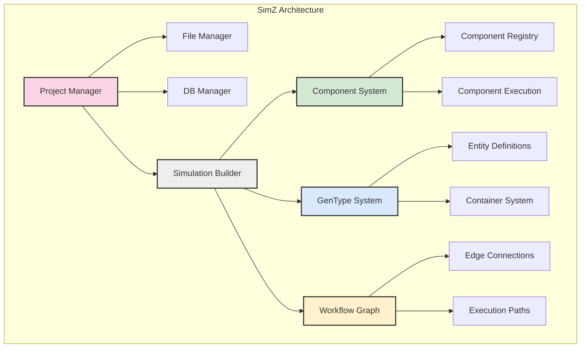
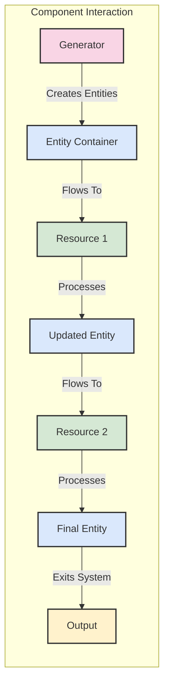
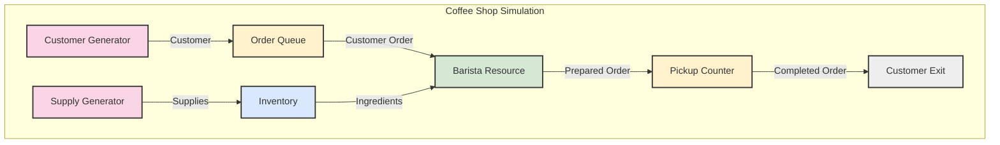
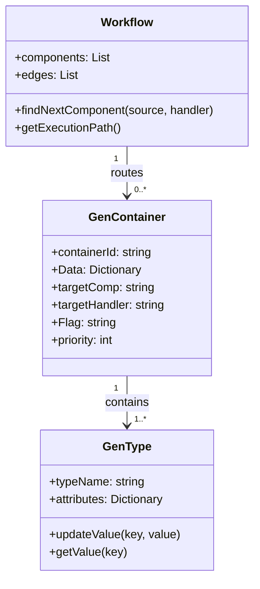
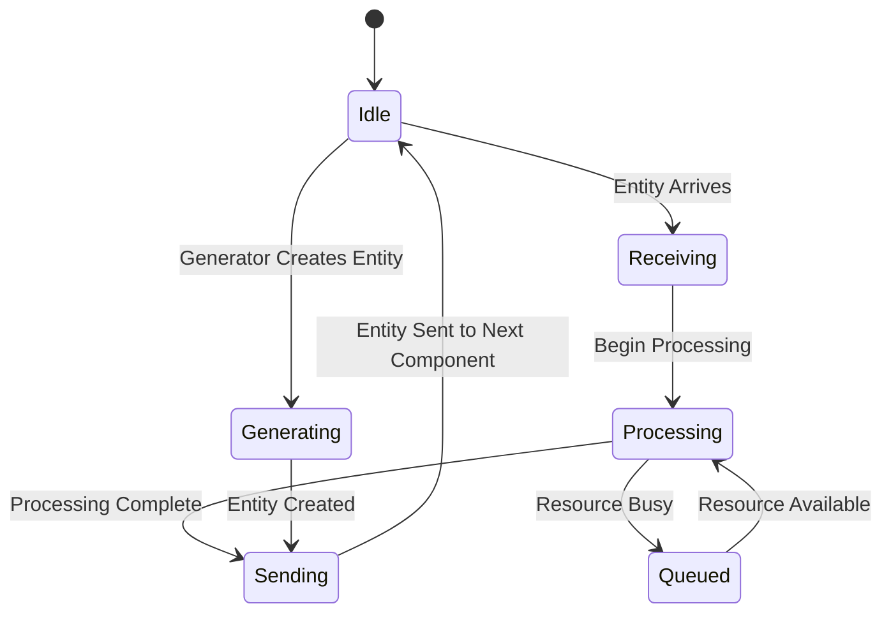
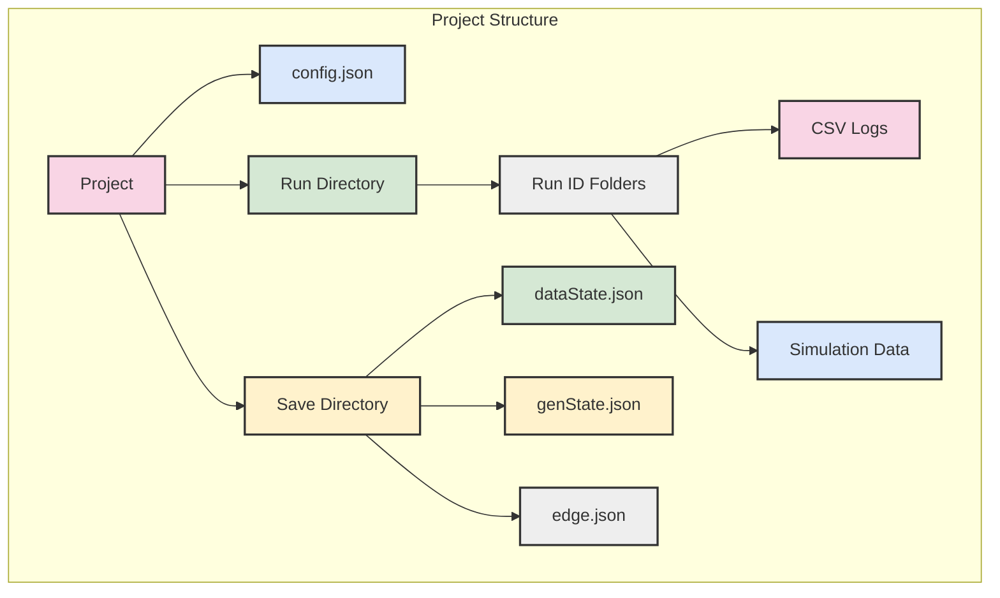

# SimZ Conceptual Diagrams

This document provides visual representations of the key concepts in SimZ to complement the conceptual overview.

## 1. Core Components of SimZ Architecture

## 2. Discrete Event Simulation Timeline

```mermaid
gantt
    title SimZ Discrete Event Timeline
    dateFormat  s
    axisFormat %S
    
    section Events
    Customer Arrival      :a1, 0, 1s
    Order Placement       :a2, after a1, 2s
    Food Preparation Start:a3, after a2, 1s
    Food Preparation End  :a4, after a3, 5s
    Food Delivery         :a5, after a4, 1s
    Customer Departure    :a6, after a5, 3s
    
    section Simulation Clock
    Clock Jumps           :crit, 0, 13s
```

## 3. Component Interaction Model

## 4. Workflow Example: Coffee Shop Simulation

## 5. Entity Structure and Flow

## 6. Mental Model for Simulation Design

```mermaid
graph TD
    subgraph "Simulation Design Process"
        A[Identify Entities] --> B[Define Attributes]
        B --> C[Map Process Flow]
        C --> D[Identify Resources & Constraints]
        D --> E[Define Component Behaviors]
        E --> F[Connect Components]
        F --> G[Run Simulation]
        G --> H[Analyze Results]
        H --> I[Refine Model]
        I -->|Iterate| C
    end
    
    style A fill:#f9d5e5,stroke:#333,stroke-width:2px
    style B fill:#dae8fc,stroke:#333,stroke-width:2px
    style C fill:#d5e8d4,stroke:#333,stroke-width:2px
    style D fill:#fff2cc,stroke:#333,stroke-width:2px
    style E fill:#eeeeee,stroke:#333,stroke-width:2px
    style F fill:#f9d5e5,stroke:#333,stroke-width:2px
    style G fill:#dae8fc,stroke:#333,stroke-width:2px
    style H fill:#d5e8d4,stroke:#333,stroke-width:2px
    style I fill:#fff2cc,stroke:#333,stroke-width:2px
```

## 7. Component State and Execution

## 8. Project Structure Visualization

## Notes on Using These Diagrams

These diagrams are created using Mermaid, a markdown-based diagramming tool. They can be rendered in many markdown viewers that support Mermaid syntax, including GitHub, GitLab, and various markdown editors.

The diagrams provide visual representations of:

1. The overall SimZ architecture
2. How discrete events work in a timeline
3. How components interact with entities
4. A practical workflow example (coffee shop)
5. The structure of entities and their flow
6. The mental model for designing simulations
7. Component states and execution flow
8. The physical project structure

These visuals complement the conceptual overview by providing a way to see the relationships between different elements of the SimZ system.
